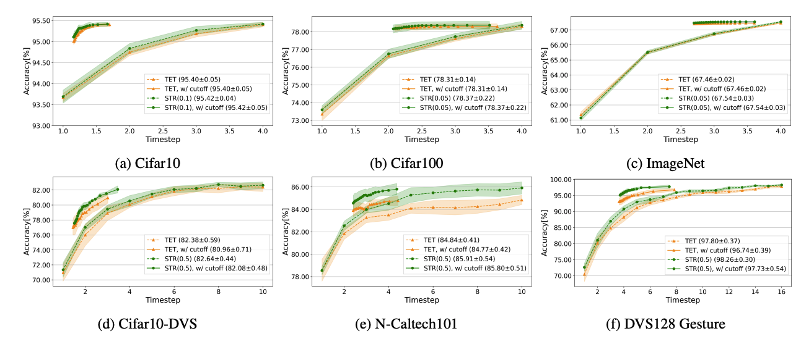

# Direct Training Needs Regularisation: Anytime Optimal Inference Spiking Neural Network


<p align="center">

</p>

The Spatial Temperal Regulariser (STR) improves SNN relaibity at each timestep. 

## More detalis
For more details, please refer to the <a href="https://arxiv.org/abs/2405.00699">preprint</a>.

```
@article{wu2024direct,
  title={Direct Training Needs Regularisation: Anytime Optimal Inference Spiking Neural Network},
  author={Wu, Dengyu and Qi, Yi and Cai, Kaiwen and Jin, Gaojie and Yi, Xinping and Huang, Xiaowei},
  journal={arXiv preprint arXiv:2405.00699},
  year={2024}
}
```
